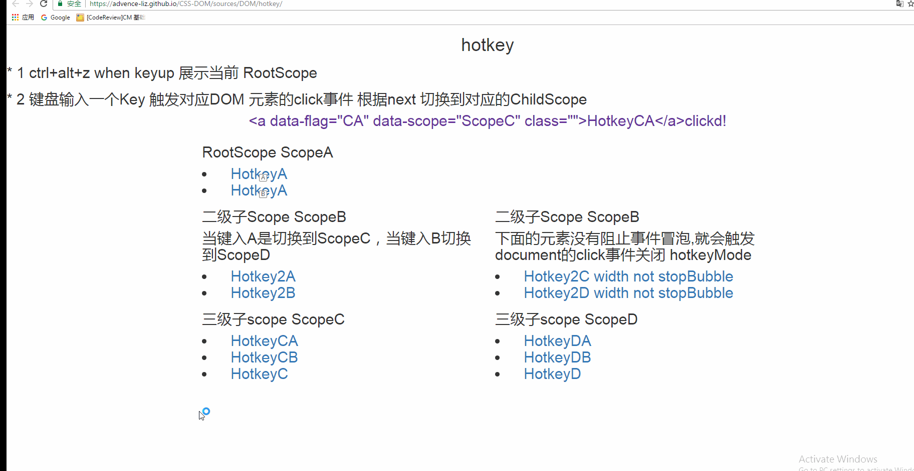

# Hotkey System

本文意在说明 hotkey 系统的实现，简单描述一下hotkey系统的行为：
- 当用户键入 Ctrl+Alt+Z 时激活 hotkeyMode 页面上的一些元素就会浮现 tooltip(提示对应元素的hotkey 是什么) 这里我们提出第一个抽象概念Scope 此时浮现 tooltip 的元素处于同一个Scope 中。
- 当用户键入 指定hotkey 另外的一些元素 浮现 tooltip，之前的元素tooltip 消失，即上一Scope 元素 tooltip 隐藏，当前Scope 元素tooltip 浮现
- 当任意时刻Click 页面 hotkeyMode 关闭，当再次Ctrl+Alt+Z hotkeyMode 激活，此时一些元素tooltip 浮现，这里你可能发现个问题 当我激活hotkeyMode的时候显示那个Scope中的所有元素呢？
在这里提出另外一个概念RootScope 当激活hotMode 时显示的为当前RootScope 中的内容，RootScope跟其他Scope没什么区别我们只是将某一个Scope设定为RootScope 而已，而且RootScope还可以随时改变。
- 可以具体参考下文的流程图或者最下面的动图
## Hotkey Class
上文提出了Scope 概念，那我们如何表示一个hotkey 元素，每个hotkey 元素相对于一个 Hotky Class 的实例。

Hotkey Class示意图见下图：其包涵 flag,scope,next,bubble 四个属性

- falg：定义hotkey 要显示的提示（标题）
- scope：定义当前Scope
- next：当前hotkey 被激活时进入的ChildScope
- bubble:事件冒泡（默认阻止事件冒泡）

当然这里并不需要大家在javascript中逐个初始Hotkey instance,我只要在作为hotkey的元素中配置上对应的 html 属性即可
```xml
                <section>
                    <li>
                        <a data-flag="A" data-next="ScopeC" data-scope="ScopeB"  href="javascript:;">hot</a>
                    </li>
                    <li>
                        <a data-flag="B" data-next="scope32" data-scope="ScopeB" data-bubble="true" href="javascript:;">not stopBubble</a>
                    </li>

                </section>
```
## HotkeysManager  
HotkeysManager 即启动和管理Hotkey System 的类使用方法如下：

```javascript
//初始化 HotkeysManager 并设置RootScope 为ScopeA
var hotkeysManager = new HotkeysManager('ScopeA');

//当你想更改RootScope 时调用如下代码
hotkeysManager.setRootScope("ScopeB")

```
### [Online DEMO](https://advence-liz.github.io/CSS/src/hotkey.html)

## Hotkey 类图


## Hotkey instance 与 Scope 的关系
### scope 中包涵多个Hotkey instance

### Scope Tree

## HotKey System flow 
先关注主流程，随后再关注分支


## hotkey GIF
